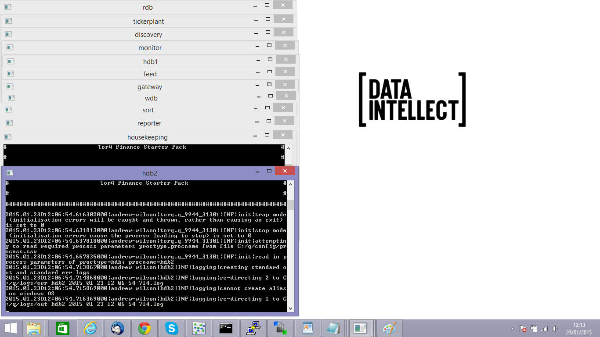
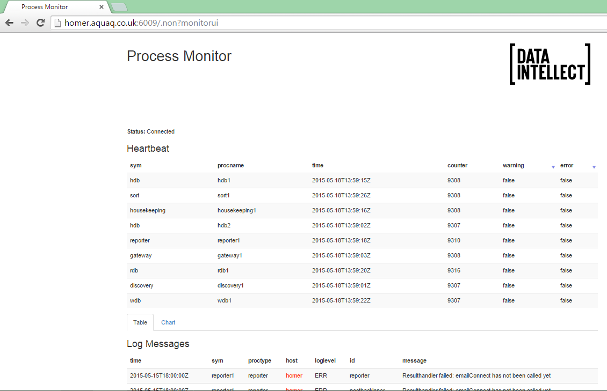

Getting Started
===============

Requirements
------------

The TorQ Finance Starter Pack will run on Windows, Linux or OSX. It
contains a small initial database of 130MB. As the system runs, data is
fed in and written out to disk. We recommend that it is installed with
at least 2GB of free disk space, on a system with at least 4GB of RAM.
Chrome and Firefox are the supported web browsers.

It is assumed that most users will be running with the free 32-bit
version of kdb+. TorQ and the TorQ demo pack will run in exactly the
same way on both the 32-bit and 64-bit versions of kdb+.

Installation and Configuration
------------------------------

### Installation

1.  Download and install kdb+ from [Kx Systems](http://kx.com)

2.  Download the main TorQ codebase from
    [here](https://github.com/AquaQAnalytics/TorQ/archive/master.zip)

3.  Download the TorQ Finance Starter Pack from
    [here](https://github.com/AquaQAnalytics/TorQ-Finance-Starter-Pack/archive/master.zip)[

4.  Unzip the TorQ package

5.  Unzip the Demo Pack over the top of the main TorQ package

### Configuration

There are additional optional configuration steps depending on whether
you want to run TorQ across multiple machines and whether you wish to
generate emails from it. Note that if you are sending emails from an
email account which requires SSL authentication from Windows (e.g.
Hotmail, Gmail) then there are some additional steps outlined in the
main TorQ document which should be followed. To run TorQ across machines
you will need to:

1.  Modify config/process.csv to specify the host name of the machine
    where the process runs. In the “host” column of the csv file, input
    the hostname or IP address

If you wish to generate emails from the system you will additionally
have to:

1.  Modify DEMOEMAILRECEIVER environment variable at the top of
    start\_torq\_demo.sh, start\_torq\_demo\_osx.sh or
    start\_torq\_demo.bat

2.  Add the email server details in config/settings/default.q. You will
    need to specify the email server URL, username and password. An
    example is:

        // configuration for default mail server
        \d .email
        enabled:1b
        url:`$"smtp://smtp.email.net:80"        // url of email server
        user:`$"testaccount@aquaq.co.uk"        // user account to use to send emails
        password:`$"testkdb"                    // password for user account

Note that on Windows there may be pop up warnings about missing
libraries. These should be resolved by sourcing the correct libraries.

Start Up
--------

### Windows

Windows users should use start\_torq\_demo.bat to start the system, and
stop\_torq\_demo.bat to stop it. start\_torq\_demo.bat will produce a
series of command prompt. Each one of these is a TorQ process.

Windows users should note that on some windows installations the
processes sometimes fail to start correctly and become blocked. The
issue appears to be how the processes connect to each other with
connection timeouts not being executed correctly. During testing, we
obsverved this behaviour on two different windows installations though
could not narrow it down to a specific hardware/windows/kdb+ version
issue. Most versions of windows ran correctly every time (as did all
versions of Linux/OSX).

### Linux and OSX

Linux users should use start\_torq\_demo.sh to start the system, and
stop\_torq\_demo.sh to stop it. OSX users should use
start\_torq\_demo\_osx.sh to start the system, and stop\_torq\_demo.sh
to stop it. The only difference between the respective start scripts is
how the library path environment variable is set. The processes will
start in the background but can be seen using a ps command, such as

    aquaq> ps -ef | grep 'torq\|tickerplant' 
    aquaq    4810 16777  0 15:56 pts/34   00:00:00 grep torq\|tickerplant
    aquaq   25465     1  0 13:05 pts/34   00:00:05 q torq.q -load code/processes/discovery.q -stackid 6000 -proctype discovery -procname discovery1 -U config/passwords/accesslist.txt -localtime
    aquaq   25466     1  0 13:05 pts/34   00:00:29 q tickerplant.q database tplogs -stackid 6000 -proctype tickerplant -procname tickerplant1 -U config/passwords/accesslist.txt -localtime
    aquaq   25478     1  0 13:05 pts/34   00:00:17 q torq.q -load code/processes/rdb.q -stackid 6000 -proctype rdb -procname rdb1  -U config/passwords/accesslist.txt -localtime -g 1 -T 180
    aquaq   25479     1  0 13:05 pts/34   00:00:04 q torq.q -load hdb -stackid 6000 -proctype hdb -procname hdb1 -U config/passwords/accesslist.txt -localtime -g 1 -T 60 -w 4000
    aquaq   25480     1  0 13:05 pts/34   00:00:05 q torq.q -load hdb -stackid 6000 -proctype hdb -procname hdb1 -U config/passwords/accesslist.txt -localtime -g 1 -T 60 -w 4000
    aquaq   25481     1  0 13:05 pts/34   00:00:06 q torq.q -load code/processes/gateway.q -stackid 6000 -proctype gateway -procname gateway1 -U config/passwords/accesslist.txt -localtime -g 1 -w 4000
    aquaq   25482     1  0 13:05 pts/34   00:00:06 q torq.q -load code/processes/monitor.q -stackid 6000 -proctype monitor -procname monitor1 -localtime
    aquaq   25483     1  0 13:05 pts/34   00:00:07 q torq.q -load code/processes/reporter.q -stackid 6000 -proctype reporter -procname reporter1 -U config/passwords/accesslist.txt -localtime
    aquaq   25484     1  0 13:05 pts/34   00:00:04 q torq.q -load code/processes/housekeeping.q -stackid 6000 -proctype housekeeping -procname housekeeping1 -U config/passwords/accesslist.txt -localtime
    aquaq   25485     1  0 13:05 pts/34   00:00:05 q torq.q -load code/processes/wdb.q -stackid 6000 -proctype sort -procname sort1 -U config/passwords/accesslist.txt -localtime -g 1
    aquaq   25486     1  0 13:05 pts/34   00:00:13 q torq.q -load code/processes/wdb.q -stackid 6000 -proctype wdb -procname wdb1  -U config/passwords/accesslist.txt -localtime -g 1
    aquaq   25547     1  0 13:05 pts/34   00:00:13 q torq.q -load tick/feed.q -stackid 6000 -proctype feed -procname feed1 -localtime

### Check If the System Is Running

TorQ includes a basic monitoring application with a web interface,
served up directly from the q process. The monitor checks if each
process is heartbeating, and will display error messages which are
published to it by the other processes. New errors are highlighted,
along with processes which have stopped heartbeating.

The monitor UI can be accessed at the address
http://hostname:monitorport/.non?monitorui where hostname is the
hostname or IP address of the server running the monitor process, and
monitor port is the port. The default monitor port is 6009. Note that
the hostname resolution for the websocket connection doesn’t always
happen correctly- sometimes it is the IP address and sometimes the
hostname, so please try both. To see exactly what it is being returned
as, open a new q session on the same machine and run:

    q)ss[html;"KDBCONNECT"] _ html:`::6009:admin:admin "monitorui[]"
    "KDBCONNECT.init(\"server.aquaq.co.uk\",6009);\n</script>\n    </body>\n</html>\n"

### Connecting To A Running Process

Any of the following can be used to easily interrogate a running q
process.

-   another q process, by opening a connection and sending commands

-   qcon

-   an IDE

The remainder of this document will use either qcon or an IDE. Each
process is password protected but the user:password combination of
admin:admin will allow access.

### Testing Emails

If you have set up emailing, you can test is using the .email.test
function (from any process). This takes a single parameter of the email
address to send a test email to. It returns the size of the email sent
in bytes upon success, or -1 for failure.

    aquaq$ qcon :6002:admin:admin
    :6002>.email.test[`$"testemail@gmail.com"]                                                                                                                                                        
    16831i

To extract more information from the email sending process, set
.email.debug to 2i.

    :6002>.email.debug:2i                                                                                                                                                                                 
    :6002>.email.test[`$"testemail@gmail.com"]                                                                                                                                                        
    16831i

Trouble Shooting
----------------

The system starts processes on ports in the range 6000 to 6014. If there
are processes already running on these ports there will be a port clash-
change the port used in both the start script and in the process.csv
file.

All the processes logs to the $KDBLOG directory. In general each
process writes three logs: a standard out log, a standard error log and
a usage log (the queries which have been run against the pro cess
remotely). Check these log files for errors.

### Debugging

The easiest way to debug a process is to run it in the foreground. By
default, TorQ will redirect standard out and standard error to log files
on disk. To debug a process, start it on the command line (either the
command prompt on Windows, or a terminal session on Linux or OSX) using
the start up line from the appropriate launch script. Supply the -debug
command line parameter to stop it redirecting output to log files on
disk.

If the process hits an error on startup it will exit. To avoid this, use
either -stop or -trap command line flag. -stop will cause the process to
stop at the error, -trap will cause it to trap it and continue loading.
An example is below. This query should be run from within the directory
you have extracted TorQ and the TorQ Finance Starter Pack to.

    q torq.q -load code/processes/rdb.q -stackid 6000 -proctype rdb -procname rdb1 -U config/passwords/accesslist.txt -localtime -g 1 -T 180 -debug -stop

File Structure
--------------

The file structure can be seen below.

    |-- AquaQTorQFinanceStarterPack.pdf
    |-- LICENSE
    |-- README.md
    |-- appconfig
    |   `-- settings        <- modified settings for each process
    |       |-- compression.q
    |       |-- feed.q
    |       |-- gateway.q
    |       |-- killtick.q
    |       |-- monitor.q
    |       |-- rdb.q
    |       |-- sort.q
    |       |-- tickerplant.q
    |       `-- wdb.q
    |-- code
    |   |-- common
    |   |   `-- u.q         <- kdb+ tick pubsub script
    |   |-- hdb         <- extra functions loaded by hdb procs
    |   |   `-- examplequeries.q
    |   |-- processes
    |   |   `-- tickerplant.q
    |   |-- rdb         <- extra functions loaded by rdb procs
    |   |   `-- examplequeries.q
    |   `-- tick            <- kdb+ tick
    |       |-- feed.q      <- dummy feed from code.kx
    |       |-- tick        
    |       |   |-- database.q  <- schema definition file
    |       |   |-- r.q
    |       |   `-- u.q
    |       `-- tick.q      <- kdb+ tick
    |-- config
    |   |-- application.txt     <- TorQ demo pack banner
    |   |-- compressionconfig.csv   <- modified compression config
    |   |-- housekeeping.csv    
    |   |-- passwords
    |   |   |-- accesslist.txt  <- list of user:pass who can connect to proccesses
    |   |   `-- feed.txt        <- password file used by feed for connections
    |   |-- process.csv     <- definition of type/name of each process
    |   |-- reporter.csv        <- modified config for reporter
    |   |-- dqcconfig.csv       <- modified config for dqc
    |   `-- dqedetail.csv       <- csv explaining function in the dqc
    |   |-- dqengineconfig.csv       <- modified config for dqe
    |-- hdb             <- example hdb data
    |   `-- database
    |       |-- 2015.01.07
    |       |-- 2015.01.08
    |       `-- sym
    |-- dqe
    |   `-- dqcdb       <- example dqc data
    |       |-- database
                |-- 2020.03.16
                `-- sym
    |   `-- dqedb       <- example dqe data
    |       |-- database
                |-- 2020.03.16
                `-- sym
    |   |-- 2015.01.07
    |   |-- 2015.01.08
    |   `-- sym
    |-- setenv.sh           <- set environment variables
    |-- start_torq_demo.bat     <- start and stop scripts
    |-- start_torq_demo.sh
    |-- start_torq_demo_osx.sh
    |-- stop_torq_demo.bat
    `-- stop_torq_demo.sh

The Demo Pack consists of:

-   a slightly modified version of kdb+tick from Kx Systems

-   an example set of historic data

-   configuration changes for base TorQ

-   additional queries to run on the RDB and HDB

-   start and stop scripts

Make It Your Own
----------------

The system is production ready. To customize it for a specific data set,
modify the schema file and replace the feed process with a feed of data
from a live system.

